The halls of my coding past are littered with the remains of projects that never lived to see another day. From broken versions, to lost files, to errors I couldn’t decipher…_these were the days of my early Git career as I relentlessly failed to make sense of its ecosystem…_

But alas! My continuous integration pipeline is working well these days, so let my past trials and tribulations light your way as I share my beloved version control methods with you.

This article assumes...

1. you've initialized a local git repository.
2. you've connected it to a remote repository in GitHub.
3. you can SSH between the two using the CLI.

The initialized setup should look similar to this:

<u>GitHub</u>

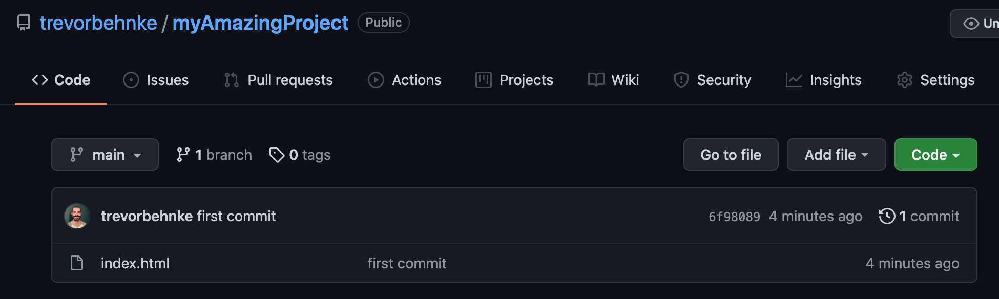

<u>Local CLI</u>

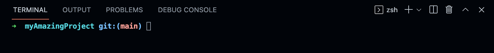

The first thing to know is that **you should work off a branch pretty much ALWAYS.** That way, when you push your local commit to your remote repo (and this is **_critical_**), you will have a chance to **review** everything before merging it into your main code and _potentially ruining it_.

So, to create a new local branch and switch to it, run:

```
git checkout -b <yourbranchname>
```

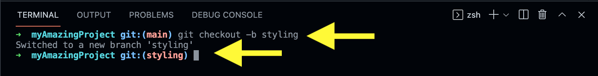

At this point, go ahead and make the changes to your code. In this example, for simplicity’s sake, I’m adding a blue background color. When you’re done with your changes and everything is saved, it’s time to add and commit your changes like usual.

To add all of your changes to the staging area, use:

```
git add .
```

And then commit all your changes and use:

```
git commit -m "<your message here>"
```

to make the changes permanent to that version:

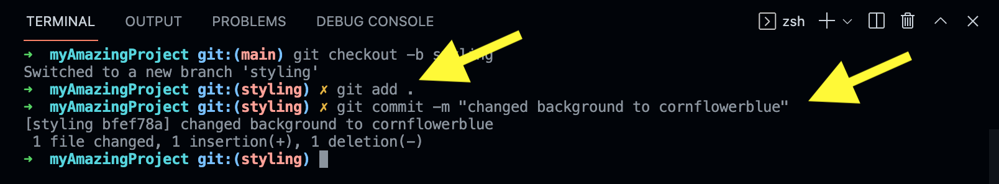

Now, THIS STEP is where we separate the **Noobs** from the **Chads**! Push your local branch up to your remote repo using:

```
git push -u origin <theNameOfYourBranch>
```

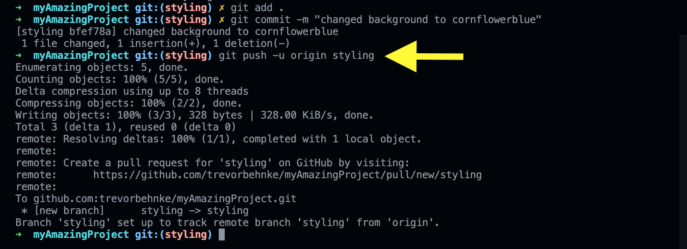

If all went well, head back over to your remote repo and you should now see that the _holy grail of continuous integration_ has popped up! Welcome to _version control Valhalla_ and the mighty **“Pull Request”**.

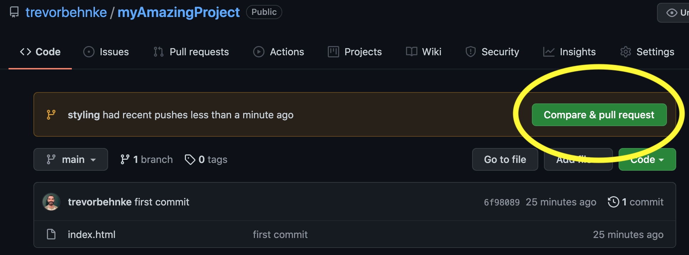

Isn’t it beautiful?

Go ahead and click through. You’ll see the message we just committed a moment ago, along with a place to add notes if you choose (good housekeeping probably calls for it but damnit I have things to do!) Click “Create pull request”:

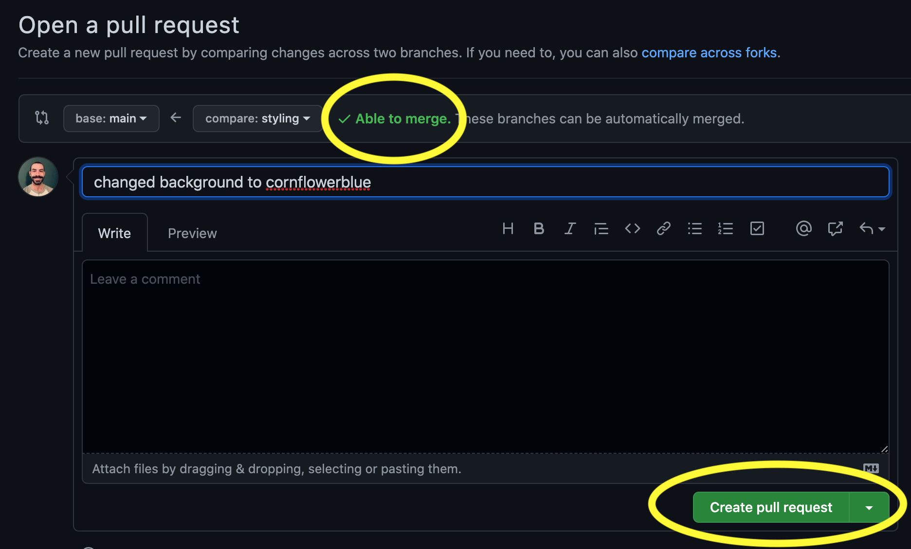

If there are no conflicts with your existing code, (if there are you'll be prompted to review the merge conflicts which is a topic for a different article), you now can merge the two branches in holy matrimony. If anyone should object, speak now or forever hold your peace (or at least until we learn about “git revert” some other time...):

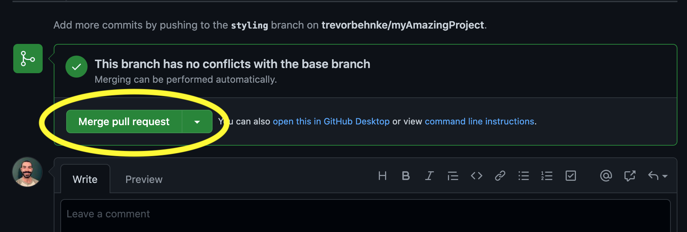

Confirm the merge:

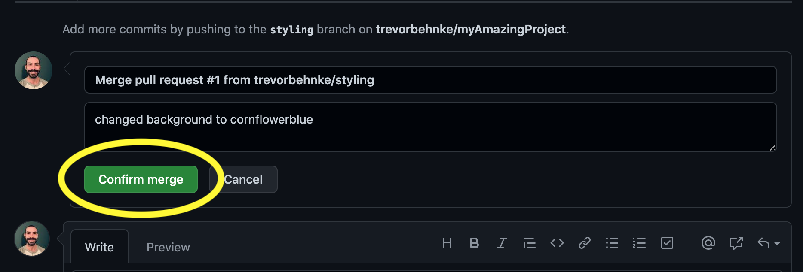

Excellent! We’ve successfully pulled the branch into the “main” one! Go ahead and delete the styling branch now.

> Your services are no longer required 😈.

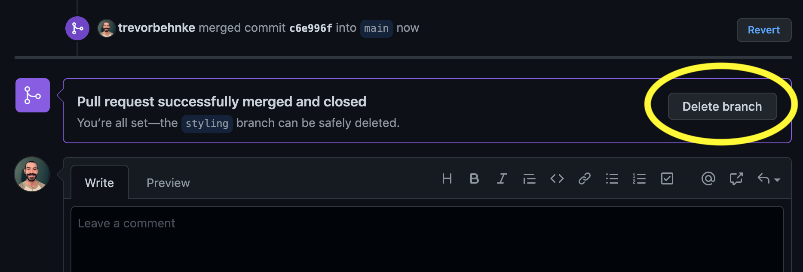

Back on your main repo page in GitHub you’ll see confirmation of the successful merge, and it should only have 1 branch at this point.

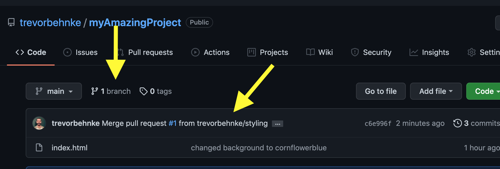

**We’re almost done!** There’s one last bit of chores to do back at our local repo. Even though our GitHub work is done for now, our local code is NOT in sync with the remote repo on GitHub. As it stands, _we still have 2 branches on our local repo, and the code in the local main branch is NOT the same as the remote repo main branch_. Obviously, that’s a problem. Let’s fix it.

Hop back into the CLI and switch back to the main branch using:

```
git checkout main
```

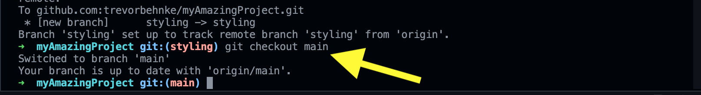

Now to get the repos in sync, we’ll pull the remote repo into the local repo using:

```
git pull
```

It will even give us a snapshot of changes made to this local main branch.

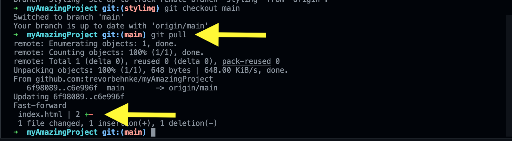

Lastly, it’s time to delete the local “styling” branch we made earlier. Run:

```
git branch
```

to see all local branches and confirm it’s still there:

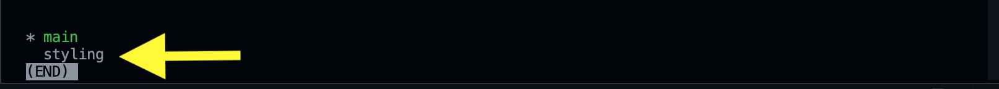

Press “q” to exit the screen, then run:

```
git branch -d <branchName>
```

to delete it:

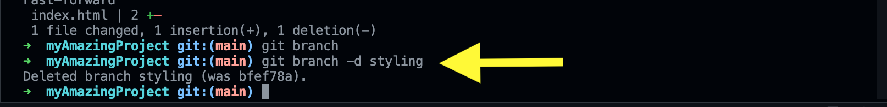

That’s it! We’ve come full circle…back to our clean and working main branch that is current with GitHub. You now know how to create a local branch of your repository, push it up to GitHub, create a pull request, merge it, sync your local repository, and delete the old branch. Congratulations! You’ve leveled up your Git game and graduated from the ranks of a total Git pleb 💪
