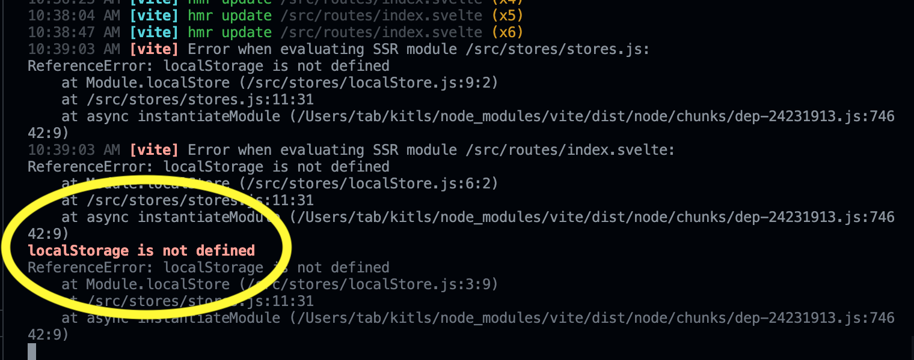
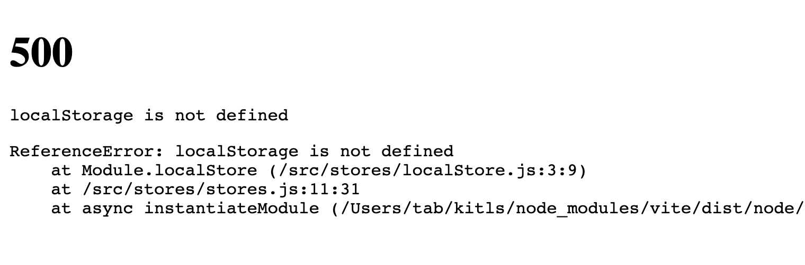
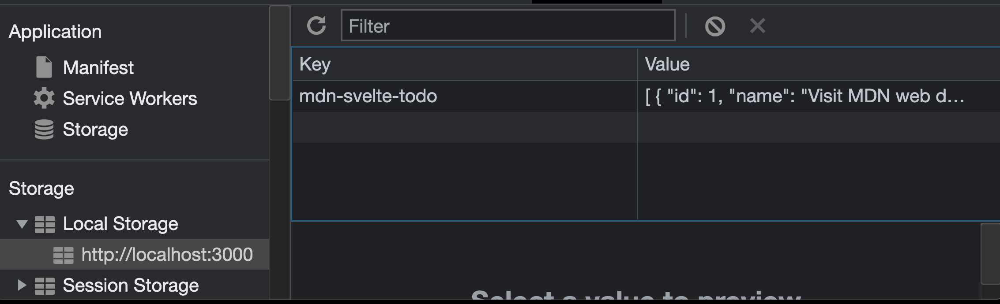
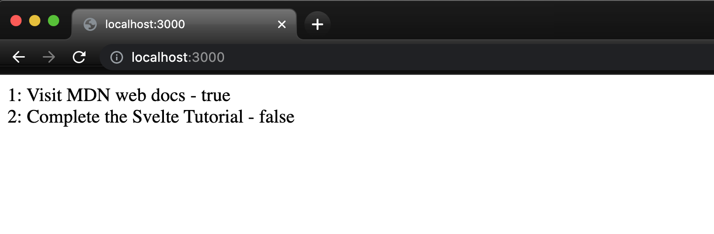

Pesisting data to local storage is super straight-forward in Svelte. Add that to the growing list of reasons why I find myself working with it.

SvelteKit (pre beta) is amazing as well, however as it is still working out some bugs, persisting to local storage in "the kit" requires just a _little extra finesse_ that I had to troubleshoot to find an answer.

It all comes down to SSR (server side rendering). In most cases this is what we want, however when it comes to accessing local storage..._not so much_. By default, Svelte will try to access local storage on the server, which uh...ya know, doesn't exist.

This solution starts with an example from the MDN docs which you can find here [MDN Example](https://developer.mozilla.org/en-US/docs/Learn/Tools_and_testing/Client-side_JavaScript_frameworks/Svelte_stores#implementing_our_custom_todos_store).

Go ahead an install a fresh skeleton of SvelteKit. I'm choosing "no" for TypeScript, and "yes" for ESLint and Prettier.

In the src directory, create a folder named "stores" and create two files. One file named "persistStore.js" and other named "stores.js". The structure should look like this:

```bash
sveltekit-skeleton/
├─ src/
│ └─ routes/
│ │ └─ index.svelte/
│ └─ stores/
│ │ └─ persistStore.js/
│ │ └─ stores.js/
...rest of the files
```

The following code will work in Svelte but **_NOT_** SvelteKit (right now anyway). I will add the solution after we see the errors first...

Add the following to persistStore.js:

```javascript
import { writable } from 'svelte/store';

export const localStore = (key, initial) => {
		const toString = (value) => JSON.stringify(value, null, 2);
		const toObj = JSON.parse;

		if (localStorage.getItem(key) === null) {
			localStorage.setItem(key, toString(initial));
		}

		const saved = toObj(localStorage.getItem(key));
		const { subscribe, set, update } = writable(saved); writable store

		return {
			subscribe,
			set: (value) => {
				localStorage.setItem(key, toString(value));
				return set(value);
			},
			update
		};
};
```

The following to stores.js:

```javascript
import { writable } from 'svelte/store'
import { localStore } from './localStore.js'

export const alert = writable('Welcome to the To-Do list app!')

const initialTodos = [
  { id: 1, name: 'Visit MDN web docs', completed: true },
  { id: 2, name: 'Complete the Svelte Tutorial', completed: false }
]

export const todos = localStore('mdn-svelte-todo', initialTodos)
```

And then this to index.svelte:

```svelte
<script>
  import { todos } from '../stores/stores'
</script>

<main>
  {#each $todos as { id, name, completed }}
    <section>
      {id}: {name} - {completed}
    </section>
  {/each}
</main>
```

Right now, this logic would work in Svelte, but since we're in SvelteKit it throws the following error:




The fix is easy, and to solve this we have to do two things:

1. Import the browser environment that Svelte gives us so that it knows we're making the request on the client side.
2. Turn off SRR for the specific file where we want to render our data.

I've added comments where the changes occur. For the first change, we'll updated localStore.js as follows:

```javascript
// Here we import the Browser that Svelte give us
import { browser } from '$app/env'
import { writable } from 'svelte/store'

export const localStore = (key, initial) => {
  // We have to wrap the existing code in an "if statement" and pass in the browser, which in our case evaluates to "true" and allows the function to run successfully.
  if (browser) {
    const toString = (value) => JSON.stringify(value, null, 2)
    const toObj = JSON.parse

    if (localStorage.getItem(key) === null) {
      localStorage.setItem(key, toString(initial))
    }

    const saved = toObj(localStorage.getItem(key))
    const { subscribe, set, update } = writable(saved)

    return {
      subscribe,
      set: (value) => {
        localStorage.setItem(key, toString(value))
        return set(value)
      },
      update
    }
  }
}
```

And then update index.svelte as follows:

```svelte
<!-- Turn this file into a module so that is runs when the component is initialised -->
<script context="module">
  // Turn off server side rendering
  export const ssr = false
  import { todos } from '../stores/stores'
</script>

<main>
  {#each $todos as { id, name, completed }}
    <section>
      {id}: {name} - {completed}
    </section>
  {/each}
</main>
```

And that it! You should now be able to successfully access the default data persisted in stores.js.




I'm interested to hear other solutions...drop me a line if you find another way!
